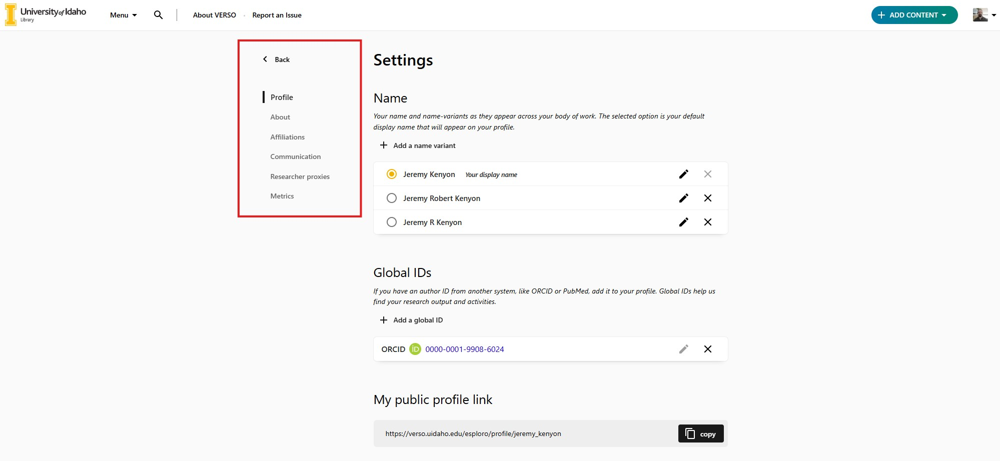
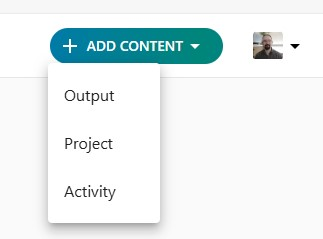
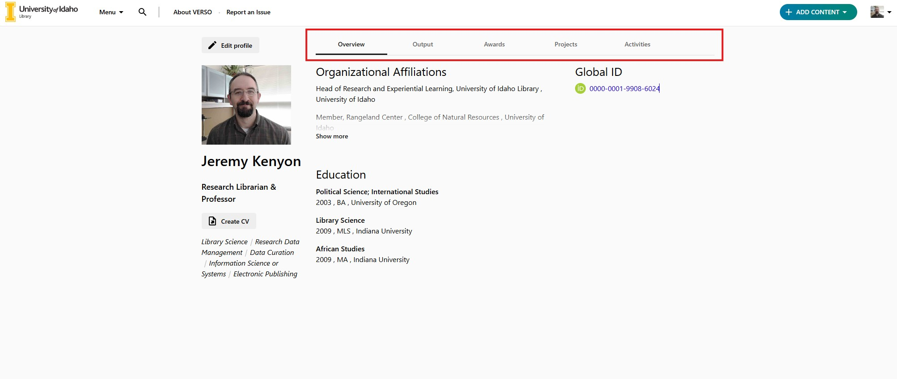
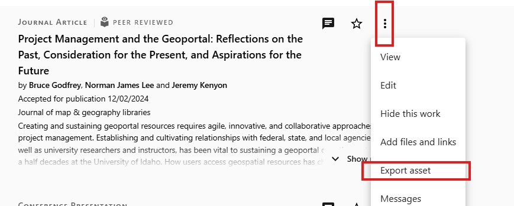
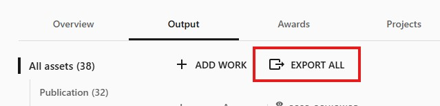
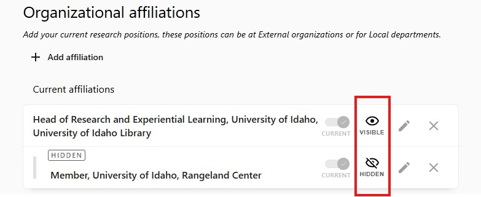
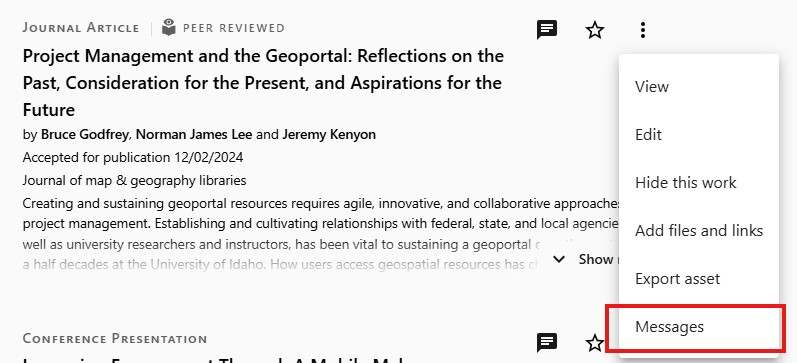

**Accessing Verso**  
Go to: <u><a href="https://verso.uidaho.edu">verso.uidaho.edu</a></u>  
1. If you do not have a Verso profile, submit a <u><a href="https://uidaho.co1.qualtrics.com/jfe/form/SV_0rlPakZsYWSG4zc">new VERSO profile request form</a></u>    
2. Use *Sign In* (top right). Go to your profile. 

**Edit Profile**  
1. Click *Edit Profile* above your profile picture. Use the left-hand tabs to update:  
     - *Profile*: Add and choose name variants, global ID's (Scopus, pubMed, ORCID), and your profile picture.  
     - *About*: Add research topic keywords, project and website links, bio, honors, and education.  
     - *Affiliations*: These can be units within the U of I or current affiliations you have at other institutions.  
     - *Researcher Proxies*: Grant other users access to manage your profile.    
</img>  

**Add Content**  
1. From your profile, click *Add Content* (top left), then choose a content type.  
</img>
- *Output*: Publications, datasets, books, chapters, scripts, etc.  
- *Projects*: Ongoing research and collaborations  
- *Activities*: Teaching, advising, service, outreach  
2. New tabs will appear on your profile as content is added   
</img>

**Exporting Output**  
Download metadata from the Output tab:  
*Single Asset*: Click the ellipsis on an item -> *Download* -> select format.  
</img>
*All Assets*: Click *Export All* at the top of the Output tab -> select format.  
</img>  

**Privacy**  
Verso is designed to show professional and research data. However, you may hide specific content from public view. 
* In *Output*: Click asset ellipsis -> *Hide this work*  
* In *About* or *Affiliations* -> Use eyeball icon and set to *Not Visible* (eyeball will be crossed out)  
</img>  
* If you would like your profile to be hidden entirely, please contact <u><a href="mailto:lib-verso@uidaho.edu">lib-verso@uidaho.edu</a></u>  
* Hiding data does not delete it. It will not be visible to the public when they use Verso, but your data will remain in our system for use in analyzing the total ouput of the U of I. If you would like your research and profile data to be completely removed from Verso, a request must be submitted in writing to <u><a href="mailto:lib-verso@uidaho.edu">lib-verso@uidaho.edu</a></u>  

**Communication**  
Contact <u><a href="mailto:lib-verso@uidaho.edu">lib-verso@uidaho.edu</a></u> for Verso related questions and requests:
- Uploading research outputs in bulk  
- Issues / inability to edit your profile  
- Major changes, errors, typos in your personal information that need to be corrected  
  
If you find a small error on an individual research asset: Use ellipsis -> *Messages* to notify the team.  
</img>  